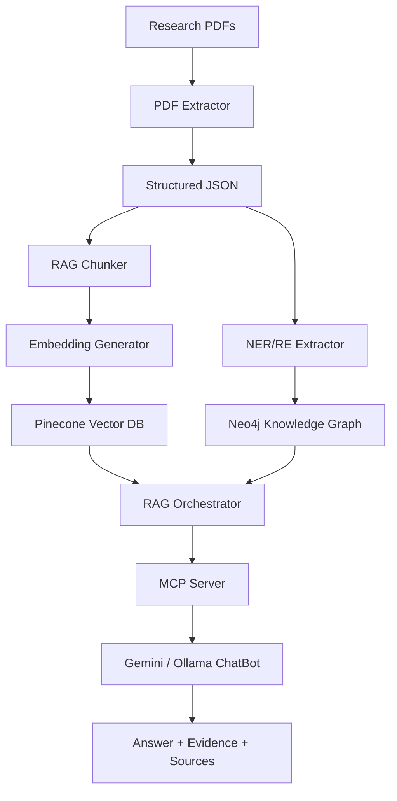

# Liver Cirrhosis Research ChatBot

An evidence-based medical research assistant for **liver cirrhosis**, built on a full RAG + Knowledge Graph pipeline. The system ingests research PDFs, extracts structured sections, builds vector embeddings and a Neo4j knowledge graph, and answers questions with cited sources from the research corpus.

> **Disclaimer:** This project is for **research and educational purposes only**. It is not a substitute for professional medical advice, diagnosis, or treatment.

---

## Features

- **PDF ingestion** — Extracts structured sections (objective, method, results, limitations, keywords, etc.) from medical research papers
- **RAG pipeline** — Chunks documents with overlap, generates embeddings, and stores them in Pinecone (3 namespaces: papers, triples, claims)
- **Knowledge Graph** — NER/RE extraction, liver-specific ontology, and Neo4j storage with provenance tracking
- **Hybrid retrieval** — Combines vector search, cross-encoder reranking, and KG path reasoning via an MCP server
- **Interactive chatbot** — Gemini-powered answers with source citations and evidence counts
- **Local LLM support** — Ollama-backed chatbot variant with Gemini → Groq → Ollama fallback chain
- **Evaluation framework** — Compare LLM-only, Vector RAG, and Full KG-MCP-RAG modes

---

## Architecture



| Layer | Technology |
|-------|------------|
| LLM | Google Gemini (primary), Groq, Ollama (fallback) |
| Vector DB | Pinecone — `papers`, `triples`, `claims` namespaces |
| Knowledge Graph | Neo4j with liver cirrhosis ontology |
| Embeddings | `all-MiniLM-L6-v2` (384-d, cosine similarity) |
| NER/RE | spaCy + custom extraction rules |

---

## Prerequisites

- **Python 3.9+**
- **API keys** (see [Configuration](#configuration))
  - [Google Gemini API key](https://aistudio.google.com/apikey)
  - [Pinecone API key](https://app.pinecone.io/)
  - *(Optional)* [Groq API key](https://console.groq.com/)
- **Neo4j** — local install or [Neo4j Aura](https://neo4j.com/cloud/aura/) *(optional; chatbot degrades gracefully without it)*
- **Ollama** — only if using the local LLM chatbot ([ollama.com](https://ollama.com/))

---

## Installation

```bash
# Clone the repository
git clone <your-repo-url>
cd liver-cirrhosis-chatbot

# Create and activate a virtual environment (recommended)
python -m venv .venv
# Windows
.venv\Scripts\activate
# macOS / Linux
source .venv/bin/activate

# Install dependencies
pip install -r requirements.txt

# Download spaCy language model (required for NER/RE)
python -m spacy download en_core_web_sm
```

---

## Configuration

1. Copy the environment template:

```bash
cp .env.example .env
```

2. Edit `.env` and add your credentials:

```env
GEMINI_API_KEY=your_gemini_api_key_here
PINECONE_API_KEY=your_pinecone_api_key_here
GROQ_API_KEY=your_groq_api_key_here          # optional

NEO4J_URI=neo4j://localhost:7687
NEO4J_USER=neo4j
NEO4J_PASSWORD=your_neo4j_password_here

INDEX_NAME=liver-cirrhosis-embeddings
DIMENSION=384
METRIC=cosine
```

> **Never commit `.env` to version control.** It is listed in `.gitignore`.

### Start Neo4j (optional)

```bash
docker run -d \
  --name neo4j \
  -p 7474:7474 -p 7687:7687 \
  -e NEO4J_AUTH=neo4j/your_password \
  neo4j:latest
```

---

## Quick Start — Run the Chatbot

Once your Pinecone index is populated (see [Data Pipeline](#data-pipeline) below):

```bash
python run_chatbot_final.py
```

Or on Windows:

```bat
START_CHATBOT.bat
```

Example questions:

- *"What are the main symptoms of liver cirrhosis?"*
- *"What causes liver cirrhosis?"*
- *"What is the relationship between hepatitis and liver cirrhosis?"*
- *"What treatments are available for decompensated cirrhosis?"*

Type `quit` or `exit` to end the session.

---

## Data Pipeline

The repository ships with **empty data directories**. Place your research PDFs in `nbib_files/` and run the pipeline to build the knowledge base locally.

### Step 1 — Add PDFs

```
nbib_files/
  paper1.pdf
  paper2.pdf
  ...
```

### Step 2 — Extract structured text

```bash
python pdf_extractor.py
```

Output → `extracted_data/` (JSON per paper)

### Step 3 — Chunk for RAG

```bash
python rag_chunker.py
```

Output → `chunked_data/` (chunks with 20% overlap)

### Step 4 — Generate embeddings

```bash
python embedding_generator.py
```

Output → `embeddings/` (numpy arrays + metadata)

### Step 5 — Upload to Pinecone

```bash
python setup_pinecone.py    # first-time setup
python pinecone_manager.py  # upload embeddings
```

### Step 6 — Build Knowledge Graph

```bash
python ner_re_extractor.py   # extract entities & relations
python setup_kg_system.py    # load into Neo4j + Pinecone namespaces
```

Or run the full pipeline in one step:

```bash
python load_data_pipeline.py
```

---

## Chatbot Variants

| Script | LLM Backend | Use Case |
|--------|-------------|----------|
| `run_chatbot_final.py` | Gemini | Primary interactive chatbot |
| `chatbot.py` | Gemini | Core chatbot module (also runnable directly) |
| `chatbot_ollama.py` | Ollama (local) | Offline / privacy-sensitive use |
| `load_and_run_chatbot.py` | Gemini | Load data then start chat |

### Ollama setup

```bash
ollama pull llama3:8b
python chatbot_ollama.py
```

---

## MCP Server

The MCP server exposes five core functions used by the chatbot:

| Function | Description |
|----------|-------------|
| `kg.search_graph` | Search entities in the knowledge graph |
| `kg.find_relations` | Find relations for a given entity |
| `kg.path_explain` | Explain paths between two entities |
| `rag.answer_with_evidence` | Retrieve evidence and draft an answer |
| `audit.provenance` | Return source provenance (DOI/PMID) |

```python
from mcp_server import MCPServer

server = MCPServer()
entities = server.kg_search_graph("portal hypertension")
answer   = server.rag_answer_with_evidence("What is liver cirrhosis?")
```

---

## Evaluation & Comparison

Three retrieval modes are compared in `comparison and experiments/`:

| Mode | Description | Latency |
|------|-------------|---------|
| **LLM-only** | Gemini with no retrieval | ~2 s |
| **Vector RAG** | Pinecone semantic search + reranking | ~3–5 s |
| **Full KG-MCP-RAG** | Vector RAG + Neo4j graph reasoning | ~5–8 s |

Run the comparison scripts (requires a query Excel file):

```bash
python "comparison and experiments/run_mode_comparison_excel.py"
python "comparison and experiments/run_mode_comparison_excel_ollama.py"
```

See [`comparison and experiments/RESULTS_AND_DISCUSSION.md`](comparison%20and%20experiments/RESULTS_AND_DISCUSSION.md) for detailed analysis.

Evaluate chatbot metrics:

```bash
python evaluate_chatbot_metrics.py
```

---

## Project Structure

```
.
├── README.md                          # This file
├── requirements.txt
├── .env.example                       # Environment variable template
├── .gitignore
│
├── # ── Data pipeline ──
├── pdf_extractor.py                   # PDF → structured JSON
├── rag_chunker.py                     # JSON → RAG chunks
├── embedding_generator.py             # Chunks → embeddings
├── pinecone_manager.py                # Upload to Pinecone
├── ner_re_extractor.py                # Entity & relation extraction
├── setup_kg_system.py                 # Full KG setup
├── load_data_pipeline.py              # End-to-end data loader
│
├── # ── Core system ──
├── liver_ontology.py                  # Entity/relation schema
├── neo4j_kg_store.py                  # Neo4j interface
├── pinecone_enhanced.py               # Multi-namespace Pinecone manager
├── rag_orchestrator.py                # Hybrid retrieval + reranking
├── mcp_server.py                      # MCP function server
├── llm_fallback_client.py             # Gemini → Groq → Ollama fallback
│
├── # ── Chatbot ──
├── chatbot.py                         # Gemini chatbot
├── chatbot_ollama.py                  # Ollama chatbot
├── run_chatbot_final.py               # Main entry point
├── START_CHATBOT.bat                  # Windows launcher
│
├── # ── Data directories (empty — populate locally) ──
├── nbib_files/                        # Input PDFs
├── extracted_data/                    # Extracted JSON
├── chunked_data/                      # RAG chunks
├── embeddings/                        # Vector embeddings
├── kg_data/                           # KG entity/relation files
│
├── # ── Docs & evaluation ──
├── CHATBOT_README.md
├── KG_SYSTEM_README.md
├── QUICK_START.md
└── comparison and experiments/
    ├── RESULTS_AND_DISCUSSION.md
    ├── run_mode_comparison_excel.py
    └── run_mode_comparison_excel_ollama.py
```

---

## Troubleshooting

| Problem | Solution |
|---------|----------|
| `GEMINI_API_KEY not found` | Copy `.env.example` → `.env` and add your key |
| Pinecone connection error | Verify `PINECONE_API_KEY` and index name in `.env` |
| Neo4j connection failed | Start Neo4j locally or update `NEO4J_URI` — chatbot works without KG |
| Slow first response | Normal — model and index load on first query |
| `spacy` model missing | Run `python -m spacy download en_core_web_sm` |
| Ollama errors | Ensure Ollama is running: `ollama serve` |

---

## Corpus Statistics

When fully built, the pipeline processes **153+ research papers** and produces:

| Asset | Count |
|-------|-------|
| Paper chunks (Pinecone `papers`) | 2,710 |
| KG triples (Pinecone `triples`) | 9,713 |
| Claims (Pinecone `claims`) | 1,958 |
| Extracted entities | 4,370 |
| Extracted relations | 9,713 |

---

## Additional Documentation

- [`CHATBOT_README.md`](CHATBOT_README.md) — Chatbot usage guide
- [`KG_SYSTEM_README.md`](KG_SYSTEM_README.md) — Full architecture and component details
- [`QUICK_START.md`](QUICK_START.md) — Condensed setup guide
- [`FINAL_STATUS.md`](FINAL_STATUS.md) — System status and test results

---

## License

This project is provided as-is for academic and research use. Research papers in `nbib_files/` are subject to their respective publishers' copyright and are **not included** in this repository.

---

## Acknowledgements

Built with [Google Gemini](https://ai.google.dev/), [Pinecone](https://www.pinecone.io/), [Neo4j](https://neo4j.com/), [sentence-transformers](https://www.sbert.net/), and [Ollama](https://ollama.com/).
